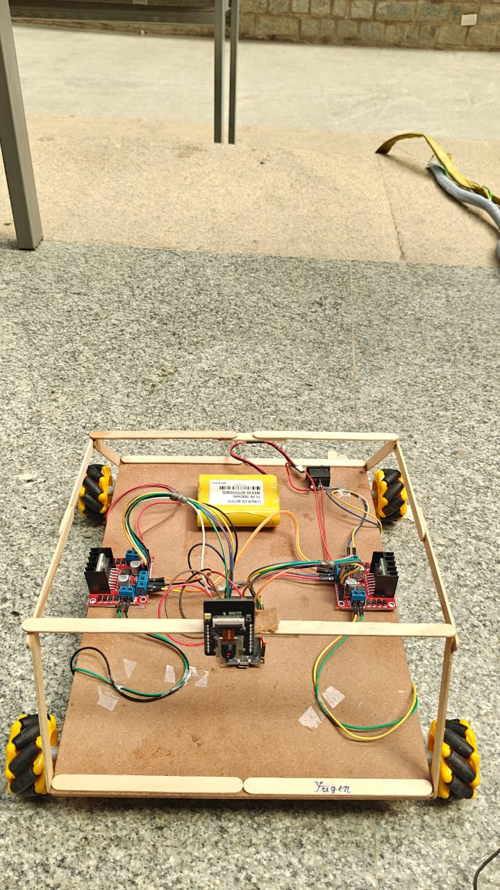

<div align="center">

# YUGĒN
### Autonomous Intelligent Surveillance Platform

**Edge AI • Robotics • Computer Vision • IoT**

</div>

---

## 📖 Vision

Modern surveillance systems are often fixed, expensive, and unable to adapt to changing environments. Yugēn explores a mobile, AI-enabled approach by combining robotics, edge computing, and computer vision into a modular surveillance platform. 

Yugēn is a modular robotics platform for exploring autonomous surveillance, edge AI, and intelligent remote operations.

---

## 🎯 Problem
Traditional security cameras are limited by their field of view. Blind spots are inevitable, and dynamic situations require flexible monitoring solutions that fixed cameras cannot provide.

## 💡 Solution
Yugēn provides an autonomous, omnidirectional rover equipped with real-time computer vision. By leveraging edge AI and modular robotics, it can patrol, detect events, and adapt to its environment autonomously.

---

## 🚀 Capabilities

### Autonomous Mobility
* **Differential/Omnidirectional Drive**: 4-wheel Mecanum drive for complex maneuvering.
* **Path Navigation**: Foundation for SLAM and point-to-point routing.
* **Obstacle Avoidance**: Future integration of depth sensing.
* **Remote Override**: Instant manual control via low-latency WebSocket.

### Computer Vision
* **Live Video Streaming**: Real-time MJPEG/JPEG streaming from ESP32-CAM.
* **Object Detection**: YOLOv8-powered person and vehicle tracking.
* **Motion Detection**: Frame-by-frame analysis for anomaly detection.
* **Facial Recognition**: Integrated `dlib` facial matching for known entities.

### Remote Operations
* **Web Dashboard**: Centralized Python/OpenCV control center.
* **Telemetry**: Real-time FPS, network latency, and connection status.
* **Event Recording**: Automated video evidence capture.
* **OTA Updates**: Ready for over-the-air firmware upgrades.

### Edge Intelligence
* **On-device Processing**: Distributed workload between rover and host.
* **Event Detection**: Multi-threaded AI inference without dropping frame rates.
* **Sensor Fusion**: (Roadmap) Combining vision with IMU data.

---

## 🏗️ System Architecture

```text
          AI Dashboard (Host PC)
                │
        Wi-Fi (WebSockets / Serial)
                │
      ┌────────────────────┐
      │      ESP32         │
      │ Motor Controller   │
      │ Video Streaming    │
      │ Telemetry Engine   │
      └────────────────────┘
          │          │
     Camera       Motors (L298N)
          │
      AI Processing
          │
     Detection Events
          │
     Video Evidence
```

---

## ⚙️ Hardware Overview

<p align="center">
  
  
</p>

* **Microcontroller**: ESP32 / ESP32-CAM (Edge Processing & Comm)
* **Motor Drivers**: 2x L298N Dual H-Bridge
* **Actuators**: 4x DC Gear Motors with Mecanum Wheels
* **Power**: Custom Li-ion battery pack

---

## 💻 Software Stack
* **AI & Vision**: OpenCV, YOLOv8 (Ultralytics), `face_recognition` (dlib)
* **Backend**: Python, WebSockets, NumPy
* **Firmware**: C++ / Arduino Core (ESP32)

---

## 📊 Development Status

| Feature | Status |
| :--- | :---: |
| Rover Chassis | ✅ |
| Motor Control | ✅ |
| Camera Streaming | ✅ |
| Remote Control | ✅ |
| Edge AI Detection | 🚧 |
| Autonomous Navigation | 🚧 |
| Multi-Robot Swarm | 📅 |
| Docking Station | 📅 |
| SLAM Mapping | 📅 |

---

## 🧠 Engineering Decisions

### Why ESP32?
* **Low power**: Ideal for battery-operated rovers.
* **Wi-Fi built-in**: Essential for live video telemetry and remote commands.
* **Large community**: Robust libraries for motor PWM and WebSockets.

### Why Edge AI?
* **Lower latency**: Processing on local networks avoids cloud round-trip times.
* **Better privacy**: Video data never leaves the local environment unless explicitly exported.
* **Reduced bandwidth**: Only alerts and compressed evidence need external transmission.

### Why Modular Design?
Allows replacing the camera, sensors, or AI models independently without rewriting the core motor control or dashboard architectures.

---

## 📁 Repository Structure

```text
Yugen/
├── assets/                  # Project screenshots and diagrams
├── docs/                    # Architectural documentation
├── firmware/
│   ├── motor_control/       # ESP32 Motor Command Listener
│   ├── camera/              # ESP32-CAM WebSocket Streaming
│   └── navigation/          # (Planned) Autonomous navigation logic
├── ai/
│   ├── vision/              # YOLOv8 weights and vision models
│   └── tracking/            # (Planned) Multi-object tracking logic
├── dashboard/
│   ├── backend/             # Main AI Surveillance Dashboard
│   └── frontend/            # (Planned) Web UI
├── mobile/                  # (Planned) Mobile remote control app
├── hardware/                
│   ├── cad/                 # 3D printable chassis components
│   └── wiring/              # Fritzing / Circuit diagrams
├── tests/                   # Unit and integration tests
├── known_faces/             # Database of authorized entities
├── recordings/              # Automated video evidence captures
└── README.md
```

---

## 🚀 Getting Started

1. **Firmware Deployment**: Flash `firmware/motor_control/esp32_car.ino` and `firmware/camera/esp32_camera_car.ino` to their respective ESP32 modules.
2. **AI Setup**: 
   ```bash
   pip install opencv-python ultralytics face_recognition websocket-client
   ```
3. **Run Dashboard**: 
   ```bash
   python dashboard/backend/ai_dashboard_pro.py
   ```

---

## 🗺️ Roadmap

### Version 1 (Current)
* Manual control, live stream, AI object/face detection dashboard.

### Version 2
* Obstacle avoidance using ultrasonic/LiDAR, automated event recording.

### Version 3
* Autonomous patrol, point-to-point route planning, and AI alerts (Telegram/AWS).

### Version 4
* Swarm robotics, edge AI optimization directly on the rover (Edge TPU), mapping.

---

## 🔬 Research Inspiration
Inspired by developments in:
* Autonomous robotics & Swarm logic
* Edge AI computation
* Advanced Computer Vision
* Intelligent Surveillance Systems
* Human–Robot Interaction

---

*Designed for the future of decentralized autonomous surveillance.*
