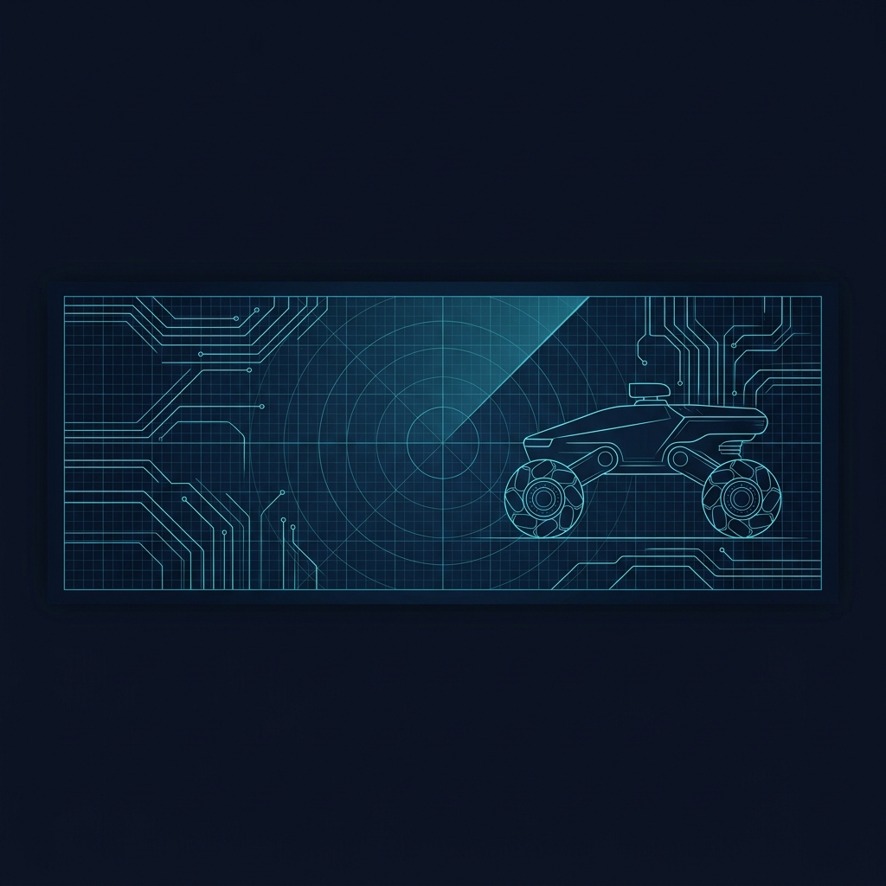
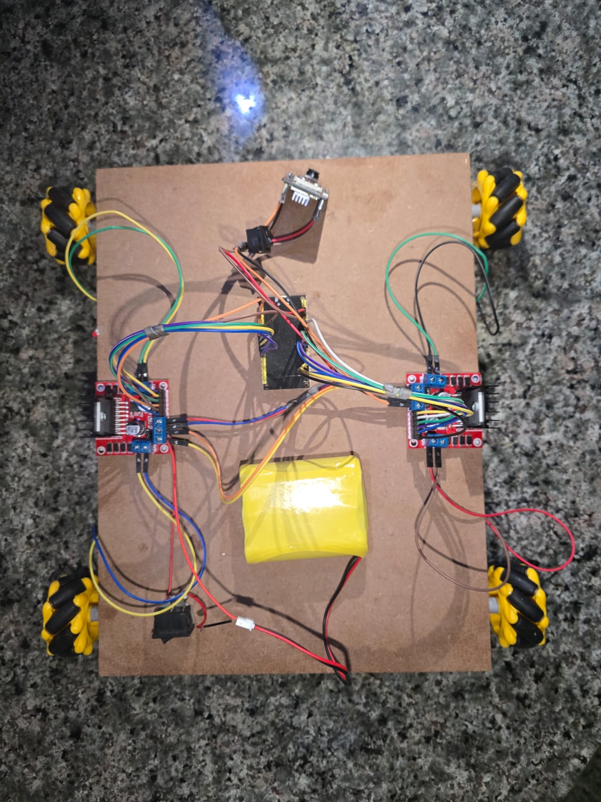
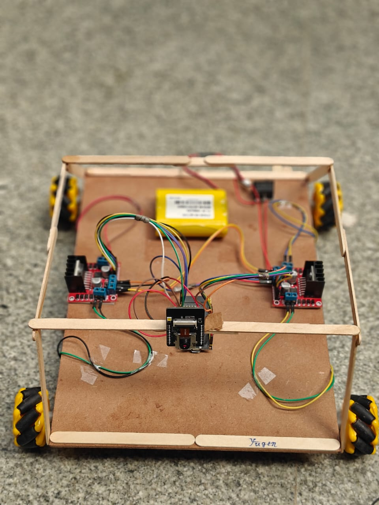
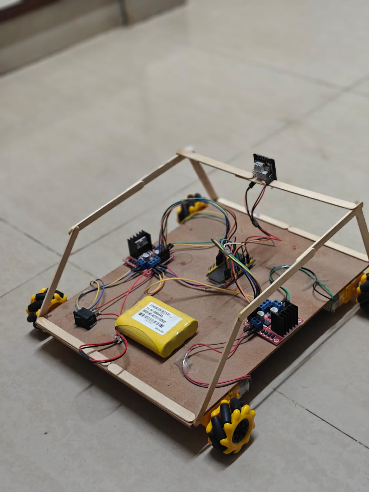
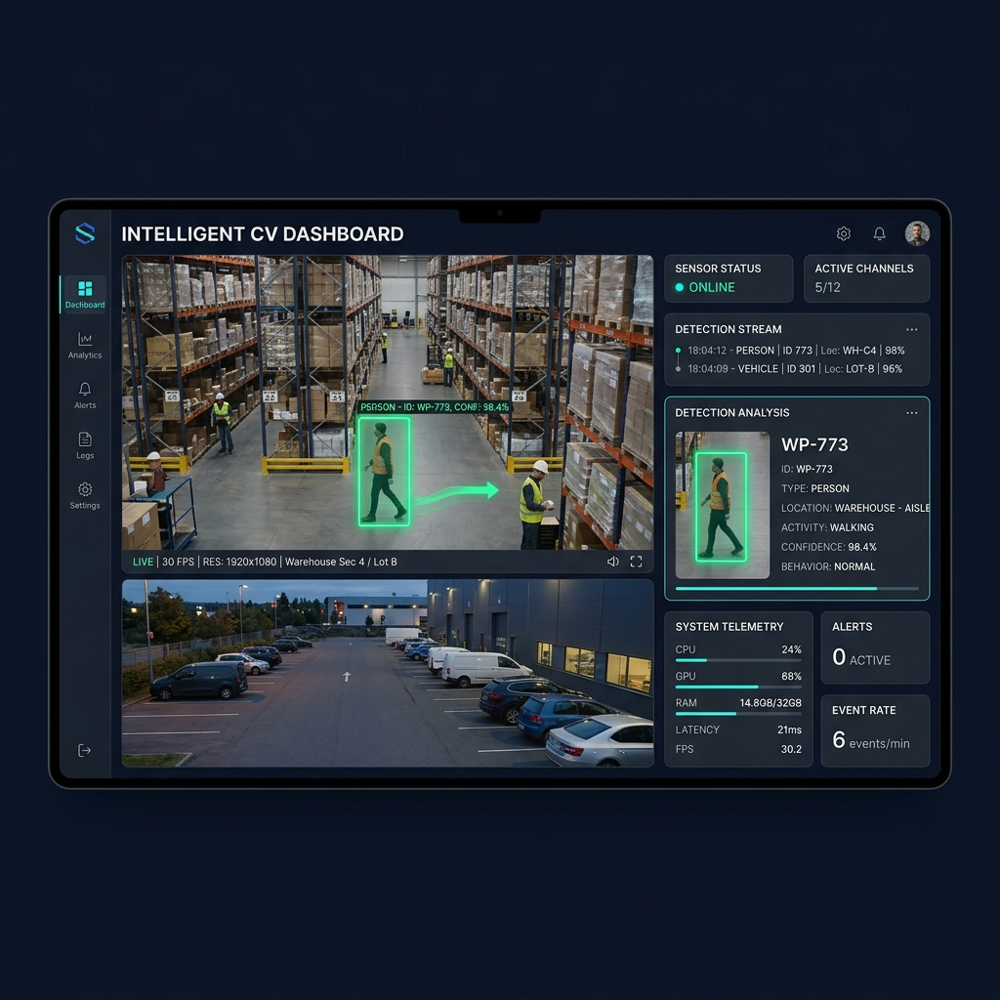

<div align="center">

# YUGĒN
### Autonomous Intelligent Surveillance Platform

**Edge AI • Robotics • Computer Vision • IoT**

*A modular robotics platform for exploring edge AI, autonomous navigation, and intelligent surveillance.*



</div>

---

## 📖 Vision

Yugēn is a modular robotics research platform exploring edge AI, computer vision, and autonomous surveillance.

Instead of fixed security cameras with inevitable blind spots, Yugēn proposes a mobile, AI-enabled approach by combining robotics, edge computing, and real-time vision into a flexible platform.

Yugēn is designed as a modular platform where perception, mobility, and intelligence can evolve independently, making it suitable for research, rapid prototyping, and future autonomous robotics applications.

---

## 📊 Repository Status

| Module | Status |
| :--- | :--- |
| 🟢 Hardware Prototype | Completed |
| 🟢 Manual Control | Completed |
| 🟢 AI Dashboard | Completed |
| 🟢 Camera Streaming | Completed |
| 🟡 AI Optimization | In Progress |
| 🟡 Autonomous Patrol | In Progress |
| ⚪ SLAM Mapping | Planned |
| ⚪ Multi-Robot Swarm | Planned |

---

## 🚀 Capabilities

### ✅ Current Capabilities
* **Live Camera Streaming**: Real-time MJPEG/JPEG streaming from ESP32-CAM.
* **Web Dashboard**: Centralized Python/OpenCV control center.
* **Manual Control**: Low-latency WebSocket integration for remote piloting.
* **YOLO Detection**: YOLOv8-powered person and vehicle tracking.
* **Face Recognition**: Integrated `dlib` facial matching for known entities.

### 🚧 Planned Features
* **Obstacle Avoidance**: Integration of depth/ultrasonic sensing.
* **Autonomous Patrol**: Point-to-point route planning.
* **SLAM**: Simultaneous Localization and Mapping.
* **Multi-Robot Coordination**: Swarm logic for distributed surveillance.

---

## 🏗️ System Architecture

### Hardware Architecture
```text
                  Web Dashboard
                         │
              HTTP / WebSocket
                         │
        ┌─────────────────────────┐
        │      ESP32 Controller   │
        └─────────────────────────┘
           │        │         │
           │        │         │
      Camera    Motor Ctrl  Sensors
           │
      Video Stream
           │
      AI Processing (Python)
           │
 ┌─────────┴─────────┐
 │                   │
YOLO Detection   Face Recognition
           │
      Event & Alerts
```

### Software Pipeline
```text
Dashboard
    │
    ▼
Video Receiver
    │
    ▼
Frame Processing
    │
    ▼
YOLOv8 Inference
    │
    ▼
Face Recognition
    │
    ▼
Detection Manager
    │
    ▼
Web Dashboard UI
    │
    ▼
Event Recording
```

---

## 📁 Repository Structure

```text
Yugen/
├── ai/                 # Computer vision models and training scripts
├── dashboard/          # Python AI inference and UI backend
├── firmware/           # ESP32 C++ code for motors and camera
├── hardware/           # Schematics and PCB designs
├── media/              # Visual assets, gallery images, and banners
├── README.md           # Documentation
└── requirements.txt    # Python dependencies
```

---

## 📸 Visual Gallery

<p align="center">
  
  
</p>
<p align="center">
  
  
</p>

<p align="center">
  
</p>

---

## ⚙️ Hardware Specifications

| Component | Description | Purpose |
| :--- | :--- | :--- |
| **ESP32 DevKit** | Microcontroller | Motion Control & Logic |
| **ESP32-CAM** | Camera Module | Video Streaming |
| **Dual L298N** | Motor Driver | High-Current Motor Control |
| **4 × DC Motors** | Actuators | Omnidirectional Movement |
| **Mecanum Wheels** | Wheels | Lateral Strafing & Rotation |
| **Custom Li-ion** | Power Supply | 12V High-Capacity Delivery |
| **Wi-Fi** | Connectivity | Wireless Telemetry & Control |

---

## 🛠️ Technology Stack

| Layer | Technology |
| :--- | :--- |
| **Firmware** | Arduino C++ |
| **AI** | YOLOv8, OpenCV |
| **Vision** | `face_recognition`, dlib |
| **Backend** | Python |
| **Communication**| WebSocket, HTTP |
| **Hardware** | ESP32, ESP32-CAM |

---

## 📈 System Metrics

### Expected Performance (Prototype)
| Metric | Value |
| :--- | :--- |
| **Camera FPS** | ~15-20 FPS |
| **Dashboard Latency** | ~100-150 ms |
| **Detection Speed** | ~10-15 FPS (Host PC dependent) |
| **Wi-Fi Range** | ~20–30 m |
| **Battery Runtime** | ~40-60 min |

---

## 🧠 Engineering Decisions

### Why ESP32?
* **Integrated Wi-Fi**: Essential for live video telemetry and remote commands.
* **Cost-effective**: Perfect for a scalable, multi-rover system.
* **Large ecosystem**: Robust libraries for motor PWM and WebSockets.

### Why YOLO?
* **Real-time inference**: Best balance of speed and accuracy for edge devices.
* **Widely adopted**: Excellent community support and pre-trained weights.
* **Good accuracy**: Reliable detection for humans and vehicles in varied lighting.

### Why WebSockets?
* **Low latency**: Persistent bi-directional connection.
* **Efficient**: Significantly lower overhead than repeated HTTP polling.
* **Real-time control**: Ideal for immediate robotic actuation and live video streaming.

### Why Python Dashboard?
* **Rapid development**: Fast iteration for UI and backend logic.
* **AI integration**: Native support for OpenCV, PyTorch, and YOLO.
* **Cross-platform**: Runs on Windows, Linux, and macOS.

### Why Mecanum Wheels?
* **Omnidirectional movement**: Essential for complex maneuvering in tight spaces.
* **Better indoor navigation**: Allows strafing without rotating the chassis.
* **Easy lateral movement**: Suitable for tracking targets while maintaining camera lock.

---

## ⚠️ Current Limitations
Being transparent about the current state of the platform:
* **Manual navigation only**: Autonomous pathing is still in development.
* **Single camera**: Relies on a single fixed-angle ESP32-CAM.
* **Requires Wi-Fi**: Needs an active network to stream to the host processing PC.
* **No autonomous mapping**: SLAM is not yet implemented.
* **Limited battery runtime**: Heavy motor usage drains the battery quickly.

---

## 🗺️ Roadmap Timeline

```text
V1 (Current)
│
├── Manual Control
├── Camera Integration
├── Live Streaming
├── YOLO Dashboard
│
V2
│
├── Obstacle Avoidance
├── Automated Event Recording
├── Enhanced Telemetry
│
V3
│
├── Autonomous Patrol
├── Smart Alerts (AWS/Telegram)
├── Edge TPU Acceleration
│
V4
│
├── SLAM Mapping
├── Swarm Robotics
├── Docking & Autonomous Charging
```

---

## 🔬 Future Research Directions

Beyond the current roadmap, Yugēn is built to explore advanced robotics concepts:
* **Edge AI Optimization**: Moving YOLO inference directly to an Edge TPU onboard the rover.
* **Sensor Fusion**: Combining LiDAR, ultrasonics, and vision for high-fidelity spatial awareness.
* **Autonomous Navigation**: Path planning in dynamic, uncharted environments.
* **Multi-Agent Robotics**: Coordinated swarm mapping and perimeter defense.
* **Energy-Efficient Patrol**: AI-driven algorithms to optimize patrol routes based on battery constraints.

---

## 🚀 Installation & Getting Started

1. **Firmware Deployment**: Flash `firmware/motor_control/esp32_car.ino` and `firmware/camera/esp32_camera_car.ino` to their respective ESP32 modules.
2. **AI Setup**: 
   ```bash
   pip install -r requirements.txt
   ```
3. **Run Dashboard**: 
   ```bash
   python dashboard/backend/ai_dashboard_pro.py
   ```

---

*Yugēn is an ongoing robotics research platform exploring edge AI, computer vision, and autonomous surveillance through modular engineering and continuous iteration.*
